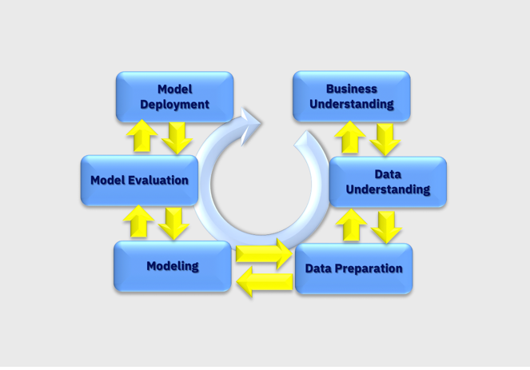

# DisasterResponse
Data Scientist Nana Degree Project - Data Engineering

This project is part of the Udacity Data Scientist Nanodegree Program: Disaster Response Pipeline Project and the goal was to apply the data engineering skills learned in the course to analyze disaster data from [Figure Eight](https://www.figure-eight.com/dataset/combined-disaster-response-data/) to build a model for an API that classifies disaster messages.

We will follow machine learning lifecycle process to approach this problem

**Business Understanding** Disaster response organizations have to to filter and pull out the most important messages from this huge amount of communications. Organizations do not have enough time to filter out these many messages manually.In this project we will use machine learning to analyze the text messages and communication into different categories like medical supplies, food, or block road.

**Data Provided** We will be analyzing real messages that were sent during disaster events. The data was collected by [Figure Eight](https://www.figure-eight.com/dataset/combined-disaster-response-data/) and provided by Udacity. More information can be found [here](https://appen.com/datasets/combined-disaster-response-data/)

Let’s look at the data description:
  1. messages.csv: Contains the id, message that was sent and genre i.e the method (direct, tweet..) the message was sent.
  2. categories.csv: Contains the id and the categories (related, offer, medical assistance..) the message belonged to.

**Data Understanding and ETL** The dataset is provided is basically composed by two files:
disaster_categories.csv: Categories of the messages
disaster_messages.csv: Multilingual disaster response messages

Data preparation steps:
  - Merge the two datasets -  merged them based on common id field
  
  
  
  - Split categories into separate category columns
  
  - One-hot encode category - Next we need to split categories field into separate field, remove categorical values to leave only numerical 0 or 1 as follows
  
  ![addproj][./images/code.png]
  
  - Remove duplicates
  
  - Upload to SQLite database

Please refer to [ETL notebook](https://github.com/neravdoshi/DisasterResponse/blob/master/data/ETL%20Pipeline%20Preparation.ipynb)

**Modeling** We will use the data to train a model that should take in the message column as input and output classification results on the other 36 categories in the datasets.The components used in the pipeline are:

  **CountVectorizer:** Convert a collection of text documents to a matrix of token counts
  **TfidfTransformer:** Transform a count matrix to a tf-idf (term-frequency times inverse document-frequency) representation
  **MultiOutputClassifier:** Multi target classification

[GridSearchCV](https://scikit-learn.org/stable/modules/generated/sklearn.model_selection.GridSearchCV.html) to exhaustive search over specified parameter values for our estimator

The dataset is highly imbalanced and so the accuracy is high and the recall value is pretty low

Please refer to [ML pipeline](https://github.com/neravdoshi/DisasterResponse/blob/master/models/ML%20Pipeline%20Preparation.ipynb)

## Web Application Demo:
This image shows the web app where messages can be classified into different categories like Related, aid related, search and rescue..

## Instructions:
1. Run the following commands in the project's root directory to set up your database and model.

    - To run ETL pipeline that cleans data and stores in database
        `python data/process_data.py data/disaster_messages.csv data/disaster_categories.csv data/DisasterResponse.db`
    - To run ML pipeline that trains classifier and saves
        `python models/train_classifier.py data/DisasterResponse.db models/disaster_ada_model.pkl`

2. Run the following command in the app's directory to run your web app.
    `python run.py`

3. Go to http://0.0.0.0:3001/ or localhost:3001

## File Descriptions

**Data:** This folder contains all the .csv files, .db file and .py file

  Data-> disaster_categories.csv/disaster_messages.csv: These files inside the data folder contains messages, their genres and different categories they beong     to.
  
  Data-> process_data.py: This code takes as its input csv files containing message data and message categories (labels), and creates an SQLite database           containing a merged and cleaned version of this data
  
  Data-> disaster.db: This file is the database which is used to fetch data whenever needed
  
**Models:** This folder contains the ML pipeline and the pickle object.

  Models-> train_classifier.py: This code takes the SQLite database produced by process_data.py as an input and uses the data contained within it to train and     tune a ML model for categorizing messages. The output is a pickle file containing the fitted model. Test evaluation metrics are also printed as part of the       training process.
  
  Models->disaster_ada_model.pkl: This file contains the fitted model so we do not need to fit the model again(note included as file is large)

**App:** This folder contains run.py and templates which are used to run the main web application

## Acknowledgement

 I really appreciate the opportunity given by Figure Eight and Udacity. This project allows me to practice a variety of data science skill sets from an complete  ML lifecycle process.
